<h3><code>sepansarr@github ~ $ whoami --ascii</code></h3>

  

<h3><code>sepansarr@github ~ $ whoami --verbose</code></h3>

  

<h3><code>sepansarr@github ~ $ ./contributions.sh</code></h3>

  

<h3><code>sepansarr@github ~ $ cat contact.txt</code></h3>

  
  
  
  
  
  

